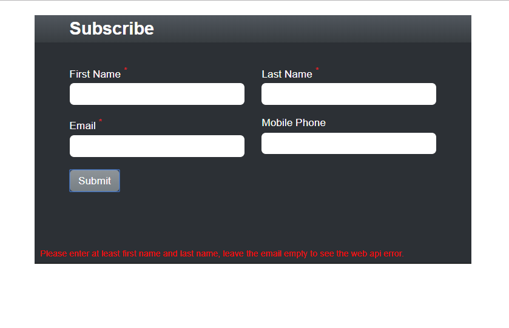

# Welcome to my subscription form demo - build with React + Node.js + Express + Jest + Enzyme

## 1. Quick Start

In the project directory, you can run:

### `npm run dev`

Runs the app in the development mode. 
Open [http://localhost:3000](http://localhost:3000) to view it in the browser.

This will bring up a node server on http://localhost:5000, and a client app on http://localhost:3000

To run the server separately, run `npm run server`

To run the client separately, run `npm start`

### `unit test`

To run unit test, run `npm run test`

unit test file can be found on \src\components\subscribe\SubscribeFrom.test.js

## 2. Main Feature

### 2.1 Page Design

This is a sample subscription page, the user enters some personal information, when submit buttion is clicked, it calls a web api endpoint, and send data to the server.

### 2.2 Client Side Validation
First Name, Last Name and Email are mandatory fields. For demonstration purpose, we use client side data validation for First Name and Last Name.

### 2.3 Server Side Validation
We use server side validation for email address, leave the email address empty, and click submit button, web api (node server) returns error, and it is captured by the client app.

### 2.4 
When all fields are entered, click submit button, it calls web api endpoint through a POST request. Once successful, it shows "Thank you for subscriping!"

### 2.5 Reponsive
The form is reponsive, below is how it looks like on mobile.

## 3. Project Strucure

